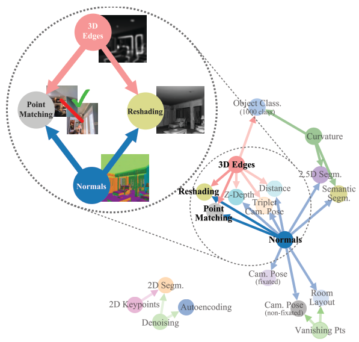

**2018/12/20**

# 《Taskonomy: Disentangling Task Transfer Learning》 #

一作是 Stanford 和 UCB 的博後 Amir Roshan Zamir，本篇獲得 2018 CVPR 的 Best Paper Award。

### 簡介 Introduction

目前對於不同 visual task，常常是個別處理，但這樣會面臨一個問題：資料的需求量會非常大，並且耗費許多重複的學習。因此，本篇試圖找出並量化 task 之間的關聯性，並利用這些資訊來使用好的 transfer learning policy，進而減少多餘的數據用量。

作者提出了一個計算 task correlations 的方法，能夠 construct 出一個 structure，這個 structure 能夠指出對於某個任務而言，它能提供給另一個任務多少有用的資訊。

獲得 task correlations 之後，利用 BIP ( Binary Integer Programming ) 可以求出在有限預算下，如何使用 transfer learning 來達到同樣好的表現。

### 方法 Method

二作沈博魁有 post 一篇他的中文解讀：https://zhuanlan.zhihu.com/p/38425434。

簡單來說，我們想要量化 task 之間的關聯性、並且利用這些關聯性來找出最好的訓練策略。作者將方法分為兩大階段，第一階段又包含三個步驟，如下：

#### 第一階段：
 **( 第一步 )**  
對於 26 個 task，都先從零開始學習 ( 使用完整數據 ) ，network 的結構是 encoder - decoder 的形式。

 **( 第二步 )**  
訓練好所有 task 各自的網路後，開始進行 transfer learning。選擇一個 source task 後，固定其 encoder 的參數並且將 encoder 的輸出 ( representations ) 餵到一個較小的 network ( read out function, decoder )，這個 network 再吐出我們要的東西，即 target task 所需的 output。
此步驟中，我們 train 的是針對不同 target task 的 read out function，當 read out function 能輸出很好的結果時，概念上就代表著 source task 能提供很有意義的 information 給 target task，此時它們的關聯性就會是高的。

另外，除了一對一的 task 關聯性 ( 稱為一階關聯 ) 以外，作者也嘗試了多對一的情況 ( 稱為高階關聯 )，即：使用多個 source task 的 representations 來當作 target task 的 input。對於五階以內的，作者根據一階的表現，在前五名裡選擇每種 task 組合都當作輸入；五階以上的，則直接選用前 n 名的 task 當作輸入。

 **( 第三步 )**  
 接下來要用 affinity matrix 來實際量化出 task relatedness。第二步中，我們獲得了許多 loss 值，但它們來自不同 loss function，因此數值上會有較大的落差。

對此，作者採用 Ordinal Normalization。首先，針對不同 target task，都 construct 出一個矩陣 Wt’，矩陣中縱軸及橫軸都對應所有 source task 和 source task 的高階組合。再來，我們計算出在 testing dataset 中，第 i 個任務 transfer 後的表現比第 j 個任務好多少倍，而這是 w(i, j)’ 的值，以下是 formula：  

接著，將 Wt’ normalize to sum to 1 後，將 Wt’ 的第 i 個 principal eigenvector 定義為第 i 個 source task 對於目前 target  task 的關聯性。將不同 target task 的 matrix 組合起來，即可獲得最終的 affinity matrix。

#### 第二階段：
有了 affinity matrix 後，我們要開始解決最根本的問題：如何找出最好的策略，使我們能夠善用 task relatedness，去 cheaply 學習一組我們感興趣的任務。

作者將此問題視為 subgraph selection 問題 ( 由 subgraph 中的 edge 來決定需要哪些 transfer )，並且利用 BIP ( Binary Integer Programming ) 來獲得最佳解。

關於這個 Integer Programming 的問題，作者提出了三個限制條件：1) 對於某個特定 transfer，它的所有 source task 都必須一起被包含到 subgraph 中 ( 例：假設選中某個具有四個 source task 的 transfer，不能只使用其中兩個或三個，即「全要」或「不要」)；2) 每個 target task 只使用一個 transfer ( 有道理，否則會不知道究竟哪個 transfer 在 contribute )；3) 不能超過 supervision budget ( 即：可以從零學習的 task 數目 )。

### 實驗 Experiments
實驗大抵上分為兩部分：解決一組任務、解決新任務。

#### 解決一組任務：  
對於一組任務 ( 在 26 個任務當中 )，作者用兩個 criterions 來衡量 taskonomy 對其的幫助。  
* Gain：進行 transfer learning 時，我們只有 target task 的少量數據，那麼假設我們使用這些少量數據來做 transfer learning 以及 train directly，前者贏過後者的勝率即為 Gain。  
* Quality：使用少量數據做 transfer learning 以及大量數據 train directly，前者贏過後者的勝率即為 Quality。

由圖片可知，只有少量數據時，transfer learning 是優於直接 train 的；而面對 fully-supervised learning，transfer learning 也能有差不多的表現。

#### 解決新任務：  

作者將 target task 限制在小量數據，模擬成一個新任務。圖中 colored 部分是 taskonomy 贏過其他 pretrained features 的勝率；uncolored 部分則是相對應的 loss。

明顯可見，taskonomy 碾壓了其他 fixed transfer policy。

### 結果 Conclusion
本文著重的是發掘出 task 之間的關聯性，並藉著這些關聯性減少數據的需求。  
我覺得面對一個新的任務，如果要把它完整加入 affinity matrix 中，需要這個 task 的大量數據，那還不如直接做 task-specific training；但如果只是當作 target ( 當作 source 的話要用完整數據 train 它的 encoder )，也許我們利用 train 好的 26 個 encoder，就可以算出 transfer policy，並使用 transfer learning 來解決這個新任務，以上情況應該只需要用到新任務的少量數據。

### 附錄 Appendix
Project page: http://taskonomy.stanford.edu  
Github: https://github.com/StanfordVL/taskonomy/tree/master/taskbank  
arXiv: https://arxiv.org/abs/1804.08328  
