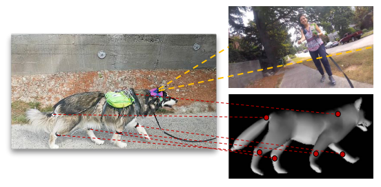
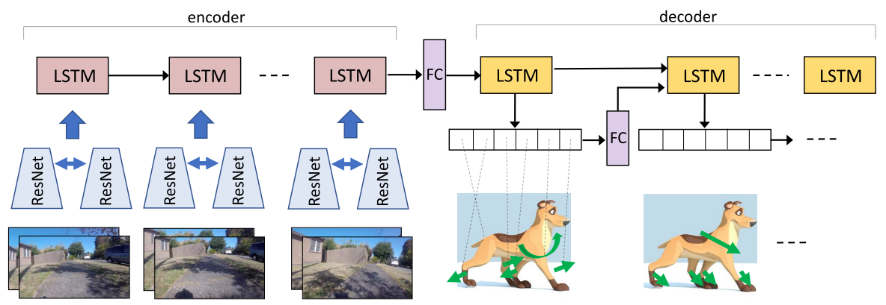
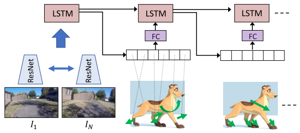
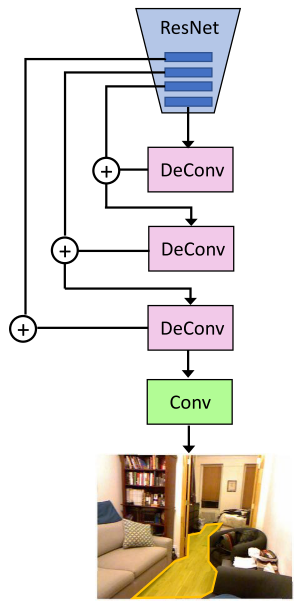

**2018/12/6**

# 《Who Let The Dogs Out? Modeling Dog Behavior From Visual Data》 #

一篇 idea 很酷的論文，拿到 2018 CVPR 的 poster。

### 簡介 introduction

這篇 paper 處理的不是平常那種 image classification、object detection 等常見的問題，而是回到 Vision 本身，直接去 model 一個擁有 vision 的個體——一隻狗。

全文主要分為三個方向，分別是 Acting like a dog、Planning like a dog、Learning from a dog。作者希望能透過 visual data 來達到模擬狗的行為，甚至學習狗是如何決定自己的動作，並且在最後也延伸出另一種貢獻：利用本篇論文提出的模型能夠 encode 出有用的資訊，而此資訊是可以 generalize 到不同的 domain。

### Acting like a dog

上圖是作者提出的 model，主要是兩個 weights shared 的 ResNet-18 搭配一個 LSTM 當作 encoder；decoder 則是一個 LSTM。

首先， ResNet 的 input 吃的是一對一對的圖片，譬如說此時間點吃的是 t 和 t+1 的圖片，下一個時間點吃的就是 t+1、t+2 的圖片。兩圖片抽出的 feature 疊起來後當作 LSTM 的 input。而 decoder 把 encoder 的 output 當作 input，接到六個 fully connected layer 後，在每個時間點 predict 出 6 個動作 ( 分別對應狗身上的六個 IMU )，這些動作又被當作下一個時間點的 input，繼續 predict 新的動作。

由於六個 joint 能組合成的動作太多，無法在 training 時搜集足夠的 data ，因此作者將每個 joint 視為 separately ( 而非 together ) ，並且在實驗中證實：每個 joint 分成八個 action class 是比較 reasonable 的。

### Planning like a dog

這部分是我覺得最有趣的 part，將兩張不連續的圖片經由 ResNet 提取出 feature，再餵進 LSTM，LSTM 會 predict 一組 48 dimensional 的數字，分別代表著六個 joints 做出各自的八個 action class 的機率，最後產生出的 sequence of actions 是要能夠讓狗看到的視野從第一張圖變成第二張圖。

從一張圖到另一張圖，雖然作者設定中間只會有五個 steps，但是可能的動作還是非常多，能夠判斷出和狗相同的動作，我覺得還滿不容易的，這個部分也是我認為最能說服別人說此篇 work 能夠 model dogs successfully 的地方。

### Learning from a dog

作者利用第一部分的 ResNet 提取出的 feature，沿用到 walkable surface estimation 與 scene classification 的 task 中，擁有很好的表現，顯示出這篇的貢獻不只是模擬一隻狗的動作，還提供了一種新的 representation，能夠 generalize 到其他不同領域。

為什麼選擇這兩個 task 呢？因為在這篇 paper 使用的 dataset ( DECADE ) 中，出現許多場景，包括室內、室外，這些地方勢必會出現許多 obstacles ( people、furniture、walls 等 ) ，因此作者認為這樣的 dataset 會讓 model 具有分辨路面 ( 包括 floor、rug 等可行走的區域 ) 和不同場景的能力。

### 結論 Conclusion

對於一個 paper 看不多的學生來說，我覺得這篇的 idea 滿新穎的，而且也學到一些感覺滿實用的技巧 ( 例如餵 time-related 的圖片時可以重疊著餵 )。最後一段也滿有趣，原來可以從 representation 下手，從 A task 來延伸到 B task，也許哪些 task 能 transfer 到哪些 task 也是可以研究的 ( 好啦其實這就是我下一篇要讀的 )。

### 附錄 Appendix

Github: https://github.com/ehsanik/dogTorch  
arXiv: https://arxiv.org/abs/1803.10827
