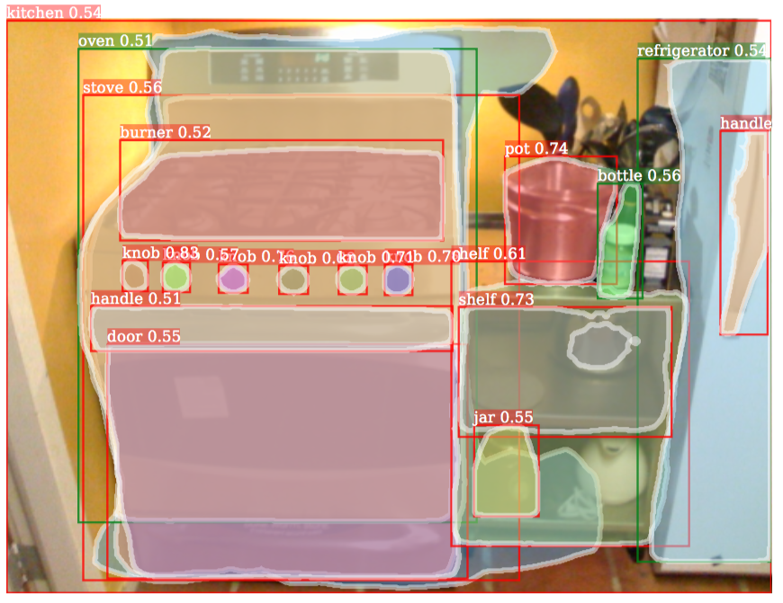
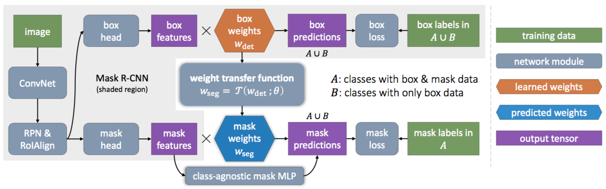

**2018/11/18**

# 《Learning to Segment Everything》

一篇來自 FAIR 大神何愷明的作品，有投上 2018 的 CVPR。

### 簡介 introduction

以往的 segmentation task 在 training 的時候，通常要有所有 class 的 mask annotation。本篇討論的就是：如果只有一部分 class 具有 mask annotation ( 以下稱為 A set )，其他只有 bounding box ( 以下稱為 B set )，是否依然能夠學習 segmentation 呢？

對於 Mask R-CNN 而言，其 detection head 中的 classification parameters 和 regression parameters 已經具有每個 class 的資訊，因此作者提出了一個 parameter transfer function ( 即一個小型的 fully connected neural network，以下簡稱 transfer fcn. ) ，讓 detection head 的參數能夠轉移到 mask head，讓 mask head 能夠有很好的 segment 能力 ( 不只是對於 A set，也能 generalize 到 B set )。

### 方法 Method

經過實驗證明，Transfer fcn. 的 input 為 classification+regression parameter 時，效果最好 ( 另外還有一個 learnable 的參數當作 input )。

本論文中的 training 主要分為兩種方式：1) Stage-wise training：首先把 bounding box head 訓練好；再來才去 train mask head，此時已經不會去更新 first stage 的參數 ( 包括 ConvNet 和 detection head 的參數 )。2) End-to-end joint training：同時 train 兩個 head。由於 A set 的 detection head 會得到 segmentation 的 loss，而 B set 的則無；當訓練 transfer fcn. 時，若計算對於 detection parameters 的梯度，會造成一種 discrepency，使 transfer fcn. 在 predict mask 的時候無法完美 generalize 到所有 class。因此在訓練 transfer fcn. 的時候只會去計算對於 learnable 參數的 gradient，而不計算對於 detection head parameter 的梯度。

另外，先介紹兩種 mask head：1) FCN head：用一層 fully convolutional network 來 predict mask。2) MLP head，用數層 fully connected layer 來 predict mask。

本篇論文將 Mask R-CNN 接上一個 class-agnostic FCN ( class-agnostic：不管 class，直接 predict mask )，當作 baseline method。並且提出：對於 baseline 跟主要方法而言，使用 fused predictor ( Baseline：class-agnostic FCN + MLP mask head / Main method： transfer fcn. + MLP mask head ) 而非單一的 predictor 能夠讓 segment 的能力更加提升。

### Experiment on COCO

作者首先在 COCO dataset ( 80 個 class，全部具有很詳細的 mask annotation ) 中做了很多實驗，試圖找出最好的搭配。最後，實驗結果顯示：當 model 為使用 transfer fcn. 的 Mask R-CNN，並且將 transfer fcn. 的 input 訂為 classification + bounding box parameter、兩層的 Layer、使用 LeakyReLU 作為 activation fcn.、搭配 fused MLP，能夠有最好的表現。

值得一提的是，使用 transfer fcn. method 時如果在 end-to-end training 的方式下沒有關閉對 detection parameter 的梯度計算，訓練出來的效果甚至會比 stage-wise training 還要差，這證實了前面提到的 discrepency 帶來的影響。

### Large-Scale Instance Segmentation

作者希望能夠透過 partially supervised training 的方式，將 segmentation 的規模提升，並且在沒有 mask annotation 的情況下，成功學習出 segment 的能力。

這部分使用的 dataset 叫做 Visual Genome ( 80 個和 COCO 重疊的 class 具有 mask，其他 2920 個 class 只有 bounding box )。由於 class 數目眾多，作者使用 stage-wise training ( first stage 只需要 train 一次，比較快速 ) 的方式，先訓練一個 Faster R-CNN 來 detect 所有 class ( 僅 bounding box )，再利用 transfer fcn. + class-agnostic MLP 的方法，訓練 mask 的部分 ( 用 80 個 class 來訓練 )。

由於 Visual Genome 中大多數 class 沒有 mask annotation，因此很難計算 AP 等數據，於是作者放上了許多 mask prediction 的 visualization。作者發現，經過這樣 partially supervised training 後，model 能夠辨識出一些較抽象的 class，像是 path、shadow 等。另外，model 會把某些 class 的 instance 當作 stuff 而非 thing，例如：單獨一棵樹可以很容易 segment 出來，但一片森林中的樹就較難 segment 出來。最後，model 也學會 segment 一個物品中的子物品，像是汽車的車窗、冰箱的把手等。

### 結論 Conclusion

整篇 paper 中，讓我最驚訝的不是 Large-Scale Segmentation 的表現，而是在 COCO 的實驗中，作者將 60 個 class 設定為只能取得 bounding box，再用 partially supervised 的方式 train，但對於那 20 個具有 mask annotation 的 class 而言，transfer fcn. 的表現竟然比 80 個 class 都開放 mask ( fully supervised ) 還要好，還滿神奇的。

總之，本篇的方法不單單只是為了能夠 segment 更多種的 class，也強調了弱監督學習的潛力，而對於用來產生更多的 mask annotation data，我相信也會有很大的幫助。

### 附錄 Appendix

Project page: http://ronghanghu.com/seg_every_thing/  
Github: https://github.com/ronghanghu/seg_every_thing  
arXiv: https://arxiv.org/abs/1711.10370
