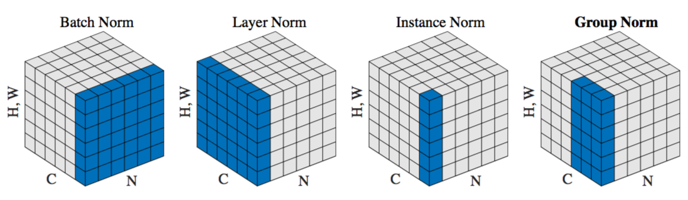

**2018/10/31**

# 《Group Normalization》 

作者是 FAIR 的大神何愷明，而這篇論文獲得了 ECCV 2018 的 Best Paper Awards Honorable Mention。

### 簡介 Introduction

這篇討論的是我們常用的 Batch Normalization（ 以下簡稱 BN ），在 batch size 太小的時候，error 會急劇地提高，這是因為 BN 是沿著 batch dimension  做 mean 和 variance 的計算，而 batch size 太小會使得每個 batch 的 mean 及 variance 相差很大，稱為不正確的 batch statistics。而本篇論文提出了一種新的方法，稱為 Group Normalization ( 以下簡稱 GN ) ，可以讓 model 在 small batch size 時，依然保持穩定的 error rate。

除了 BN 之外，比較有名的 Normalization 技巧還有 LN ( Layer Normalization ）、IN ( Instance Normalization ) 等，其中後兩種方法雖然避免了前面提到關於 batch dimension 的問題 ( 為什麼能避免下一段會說明 ) ，但是它們在很多 task 上還是達不到 BN 的準確率。後來的 BR ( Batch Renormalization ) 引進了兩個參數，用來限制 mean、variance 的範圍，使得 BR 在 small batch size 時有優於 BN 的表現，但事實上，隨著 batch size 下降，BR 的正確率仍然會跟著降低。

### 算法 Methods

從最上面那張圖可以看到，BN 所做的是「對所有在同一個 channel 的 pixel 做 normalization」；LN 做的是「對所有在同一個 batch 的 pixel 做  normalization ( 可以想成所有在同一張 feature map 上的點 ) 」；IN 做的是「對所有在同一個 batch 中、且同一個 channel 的pixel 做  normalization」。而 GN 是先在 channel dimension 上分成 G 個 group，然後才對同一個 batch 中、且屬於同一個 group 的 pixel 做  normalization。

我們可以發現到，LN、IN、GN 做 normalization 時的條件都有「在同一個 batch 中」，這代表這三個操作都和 batch size 無關。另外，由於我們是將整個 channel dimension 分成 G 個 group，假設 G = C，表示每個 group 就只有一個 channel，此時 GN 其實等同於 IN；或者是假設 G = 1，表示只有一個 group 且這個 group 包含了所有 channel，此時 GN 等同於 LN。

雖然聽起來 GN 和 IN、LN 都有相似之處，但是 GN 優於 IN 的地方在於：GN 可以同時接收到多個 channel 的資訊，而 IN 只能接收到一個；GN 優於 LN 的地方在於：假設各個 channel 間有很嚴重的 distribution difference，此時 GN 可藉由調整 G 的大小來避免掉誤差，但 LN 就只能對全部的 channel 做 normalization。

### 實驗 Experiments

作者主要比較的是 BN 和 GN 的表現，總共做了三種 task 的實驗，包含了 image classification、object detection and segmentation、video  classification。不論是哪種 task ，結果都有很明顯的趨勢：當 batch size 足夠大時，GN 與 BN 表現差不多 ( 或者說 GN 稍差一點，因為 BN 的隨機  sample batch 有點 regularization 的作用，GN 沒有這個效果 ) ；但當 batch size 下降到一定程度 ( 4 或 2 之類 ) ，GN 相較於 BN 就展現了很大的優勢。這要歸功於前面提到 GN 對 batch size 的 independency。

值得一提的是，在一些數據中顯示，隨著 G 下降，GN 的 error rate 呈現持平、緩緩下降的趨勢，但當 G 從 2 降為 1 時（ 也就是變成了 LN ）， error rate 反而又提升上去，同樣情形也發生在每個 group 中的 channel 數量從 2 降到 1 的時候。作者似乎沒有在論文中直接猜測原因，只強調這是 effect of grouping  channels（ XD ）。

最後，作者也比較了先前提到的 BR（ Batch Renormalization ），實驗結果顯示 BR 在 batch size 為 4 時的表現確實稍稍比 BN 好，但仍然不及 GN。

### 結論 Conclusion

本篇的主要貢獻其實不是在強調 small batch size 時有較好的表現，而是利用 GN 可以穩定 error rate 的特性，使得我們在設計 model 時可以考慮較小的  batch size，讓 model 的 capacity 能夠有所提升。

論文最後，作者簡短提到了由於 GN 和 LN、IN 都有相似關係，而 LN、IN 在 RNN、GAN 上有很好的表現，於是作者希望之後能朝著這條方向研究，試著把 GN 應用在  RNN、GAN、或者 RL 上面。

### 附錄 Appendix

Github: https://github.com/facebookresearch/Detectron/tree/master/projects/GN  
arXiv: https://arxiv.org/abs/1803.08494  
Slides: http://kaiminghe.com/eccv18gn/group_norm_yuxinwu.pdf
