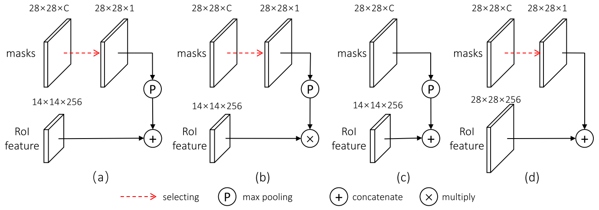
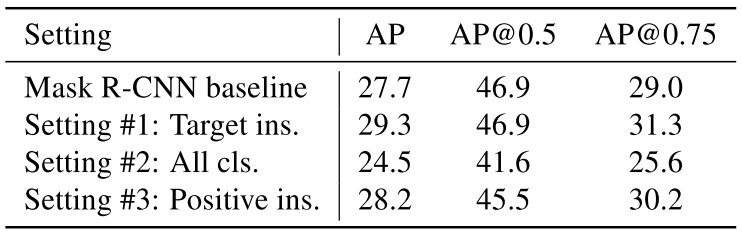

**2019/3/12**

# 《Mask Scoring R-CNN》

一篇熱騰騰的 CVPR 2019 oral，一作是來自華中科技大學的碩士，這篇是他在 Horizon Robotics 實習時做的 work。

### 簡介 Introduction
著名的 Mask R-CNN 是 two-stage 的 instance segmentation 中相當傑出的模型，然而作者看出了它的缺點。Mask R-CNN 中的 mask quality 是來自 classification 時的 score，但 mask 的準確率與 classification 的好壞通常沒有太大關係，這導致了有時候分類的很好，mask 卻框得很糟的現象發生。
作者提出了 MaskIoU，只需要在 Mask R-CNN 中新增一支 MaskIoU head，即可利用一個額外的網路來計算 mask 與 ground truth 的差距，藉此重新衡量 mask 的好壞。 

### 方法 Method

上圖為主要的架構，基本上是基於 Mask R-CNN，在右下角多了一個 MaskIoU head，以 predicted mask 及 RoI feature 作為 input，預測出 MaskIoU。
該 MaskIoU head 由四層 conv 及三層 fully connected layer 組成，最後 output 為 C 個 Multi-class 的 IoU。在 training 的時候，對於每個 Mask 而言，只選擇 ground truth 的 class 去做 regress；testing 時則是只對 predicted class 做 regress。

### 實驗 Experiments
作者在 COCO 上做了些實驗，以下直接看數據：

#### 不同 backbone 
  
上圖比較的是不同 backbone networks 的結果，數據顯示了對於不同的 backbone，此篇的方法都能讓 AP 有所提升 ( 左半部為 segmentation，右半部為 detection )。

#### 不同 MaskIoU head input
  
上圖比較了不同的 MaskIoU head input 的結果，明顯看到 AP 都是差不多的。至於這四種 setting 的差異請看下圖：  

#### 不同 training target
  
上圖比較了選擇不同 target 來 train MaskIoU head 的結果，Setting #1 指的是只使用正確的 class，其餘忽略。Setting #2 指的是把所有 class 都拿來加入訓練，若某個 class 沒有出現在該 RoI，則將其 MaskIoU 設為零 ( 這是很強烈的，沒有標記 mask 拿到的 IoU 竟和隨便亂標是一樣的，難怪這項的結果較差 )。Setting #3 指的是只考慮有出現在 RoI 的 class，沒出現的就忽略，此項結果較差，我覺得對於 target class 和其他 positive class 應該要有不同權重。

### 附錄 Appendix
Github: https://github.com/zjhuang22/maskscoring_rcnn  
arXiv: https://arxiv.org/abs/1903.00241

