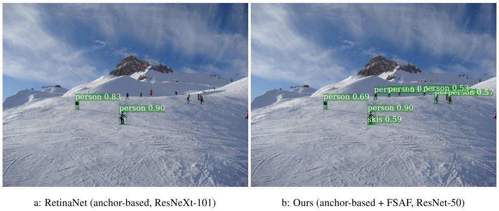
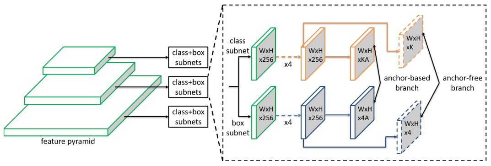
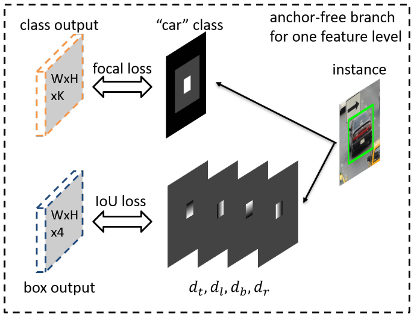
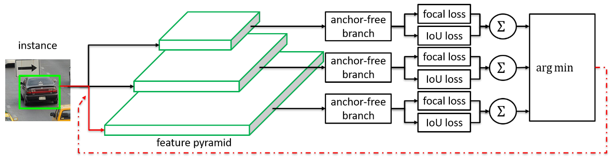
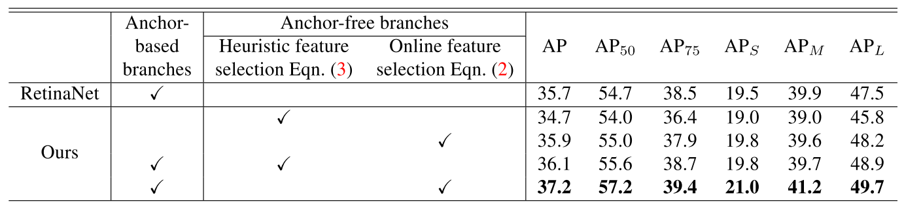
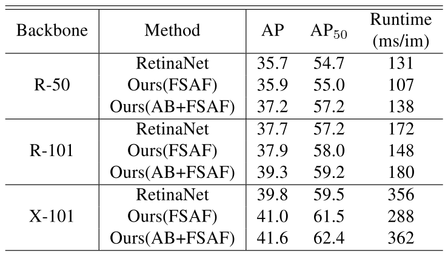

**2019/3/19**

# 《Feature Selective Anchor-Free Module for Single-Shot Object Detection》

一篇來自  CMU 的 CVPR 2019。

### 簡介 Introduction
傳統的 single-shot detector 使用 FPN 時，往往利用 instance box 的尺寸來決定要以哪一層 feature pyramid 作為學習此 instance 的 feature，即：大物體使用 higher，小物體使用 lower。然而這樣的作法是 heuristic 的，無法保證是最好的選擇方法。
本篇利用額外的 module 來決定哪個 level 對於 instance 而言是最好的，box 的尺寸不再決定 feature 的來源，因此稱為 anchor-free。

### 方法 Method

#### Network Architecture

上圖為本篇提出的 FSAF module 的示意圖。在每個 level 的 classification subnet 及 regression subnet 都加上一個 conv layer，前者產出 K 張 maps，後者產生 4 張 maps。

#### Ground-truth and Loss
給定一個 object instance，對於每層 level 都有一個它的 projection box，將此 projection box 縮小 0.5 倍及 0.2 倍後得到 ignoring box 及 effective box。

  
上圖白色部分即為 effective box region，灰色部分為 ignoring box region。

在 classification 部分，output 上每個 pixel 都是一個 K 維向量，用來表示不同類別的機率。Ground truth 中，effective box region 設為 1，ignoring box region 忽略 ( 即：梯度不回傳)，其他部分則設為 0。訓練時，將所有 non-ignoring region 的 focal loss 之和，除以 effective region 的 pixel 數量，即為 total classification loss。

在 regression 部分，output 上每個 pixel 都是一個四維向量，用來表示四個方向的 offset。Ground truth 中，除了 effective box region 以外都是忽略梯度，而 effective region 中每個點的值為該 pixel 與 projection box 的四邊之距離 ( 一個 map 負責一個方向 )。最後將每個點的四維向量除以四後，和 output 計算 IoU loss average，即為 total regression loss。

#### Online Feature Selection
  
將所有 level 的 loss 分別加總後，有最小值的 level 即被選擇來學習該 instance。

#### Joint Inference and Training
Inference 的時候，將 anchor-free branch 得到的 box 用 0.05 來篩選，選出最多一千個 box 後，和 anchor-based 的 box 一起做 NMS 來得到最後的 detections。

Training 的時候，整個 network 的 loss 是來自 anchor-based 及 anchor-free 相加得來 ( anchor-free 的項會乘以加權值 0.5 )。

### Experiments

  
上圖顯示了 anchor-free 的重要性，以及 online feature selection 對 AP 的提升。

  
上圖顯示本篇的 FSAF module 對於不同 backbone 是 robust 的。在 runtime 的部分，作者認為兩個小 conv layer 不會造成什麼額外的計算量，學長則認為這邊的 AB+FSAF 應該只是多了 NMS 的時間，而不是多去計算 anchor-free branch 的 outputs。

### 附錄 Appendix
arXiv: https://arxiv.org/abs/1903.00621  

