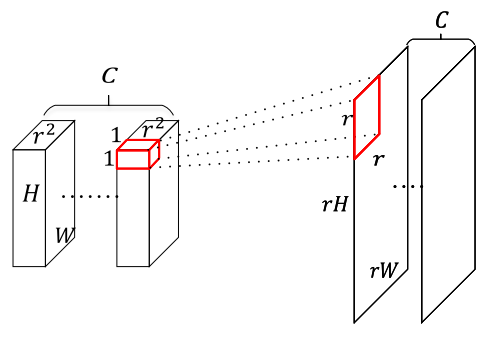

**2019/3/30**

# 《Scale-Transferrable Object Detection》

一篇 CVPR 2018 poster，提出一種能將深層的 feature maps scale up，進而用來檢測小物體的方法。

### 簡介 Introduction
小物體在圖片中已經很小，在深層的 feature maps 上更是只剩下一點點 pixels，然而太淺層的 layer 又缺乏 semantic 的特徵，對於小物體檢測效果不佳。
本篇提出一種能夠 scale up 深層 feature maps 的方法，比起傳統的 deconvolution 更有效且省時。

### 方法 Method

  
上圖為本篇提出的模型，是基於 DenseNet 的架構上做延伸。DenseNet 最後一個 block 中，每一層的 height 和 width 都相同，只有 channel 數目不同；本文將六個 layer 做不同的操作來獲得不同 scale 的 feature maps。
前三層使用 mean pooling 來縮小 scale ，第四層不變 ( 以上的 channels 數目不會改變 )；第五層和第六層使用 Scale-Transfer Layer，這東西的原理請看下圖：

  
如圖可以看到，做法是將 channel 壓縮，進而擴大 height 及 width ( 整個 scale 擴大 r^2 時，channel 也縮小 r^2 倍 )。

作者將 mean pooling 和 scale-transfer layers 稱為 scale-transfer module ( STM )。將 STM 加在 DenseNet 後面所獲得的六個不同 scale 的 feature maps，用來建構一個 one-stage 的 object detector，稱為 scale-transferrable detection network ( STDN )。
STDN 由剛剛的 base network 加上兩個 subnet 組成。第一個 subnet 是用來做 classification 的，包含一個 1x1 及兩個 3x3 的 convolution layers，最後的 output 為 KxA 個數字，K 為 object classes 數量，A 為 per spacial location 的 anchors 數量。第二個 subnet 用來做 box regression，架構與 classification subnet 相同，最後 output 為 4A 個數字。

  
Training 時，上圖為 loss function，結合了 classification 和 regression 的 loss。y_a 為 0 到 K 中其中一個，0 代表 anchor 沒有 match 到任何類別 ( 當 IoU 小於 0.5 時 )。

### Experiments

  
上圖為 PASCAL VOC2007 的實驗結果。

  
上圖為 ablation study #1。
前兩行顯示出 STM 的效果，三、四行的 stem block 指的是原本 input layer 改成三個 3x3 convolution layers 和一個 2x2 mean pooling。

  
上圖為 COCO 的實驗結果。

  
上圖為利用 PASCAL VOC2007 做速度與正確率的實驗。可以看出 STDN 在高正確率的情況下仍然能做到 real time。

### 附錄 Appendix
Github: https://github.com/arvention/STDN  
Paper: http://openaccess.thecvf.com/content_cvpr_2018/CameraReady/1376.pdf    

