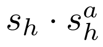

**2019/3/5**

# 《Detecting and Recognizing Human-Object Interactions》 #
一篇來自 Mask R-CNN 作者群的 paper，拿到 2018 CVPR 的 spotlight。

### 簡介 Introduction ###
本篇研究的是人與物體之間的互動關係，即：<人，動作，物體>，並將所提出的模型在 V-COCO、HICO-DET 兩個 datasets 上做實驗。

### 方法 Method ###
  
上圖為本篇的模型，主要是在 Faster R-CNN 上再加入一條 human-centric branch，用來預測人的動作，並進行物體位置的預測。
對於一個 <人，動作，物體>的 triplet，其分數為：  
  

#### Object Detection
與 Faster R-CNN 類似，先用 RPN 取出 box proposals 後，再進行 RoIAlign，最後將提取出的特徵做 classification 與 regression。

#### Action Classification ####
對於每個被判斷為人的 instance，都給出 A 個分數 ( 假設有 A 種動作 )，再利用 binary sigmoid classification 做 multi-label 的 classification ( 因為一個人可能同時做多個動作，所以是 multi-label )。

#### Target Localization ####
作者認為直接從人的 appearance 較難精確地預測 target object location，所以他們提出一個新的方法，將 human feature 與 object detection 的結果結合起來。
首先是 based on 人的 appearance 及 action 的種類，預測出一個 Gaussian 分佈，此分佈是 learnable 的。再定義一個 likelihood ( 即 triplet 分數中的第三項)：  
  
此 likelihood 可用來判斷一個 object box 與 target location prediction 的適配程度。利用 object detection 的結果來 train 此分佈，可得到更好的 location prediction。  

#### Interaction Recognition ####
模型中第三條 branch 是 optional 的，它將 action 的 prediction 從基於 human 改成基於 human 與 object 。
實際作法是分別用 human 與 object 的 feature 計算 action classification logits，兩者相加後經過 sigmoid 來得到任一組 human-object pair 配對各種動作的分數。

### Cascaded Inference ###
在 inference 的時候，作者用 NMS ( non-maximum suppression ) 來減少 box 數量，並作為後面 branches 的 input。
對於任一組 human-action pair，不直接計算所有 object 的分數，而是利用：  
  
找出最適合的 object 後才計算，而此計算結果即為 triplet 的最終分數。

另外，有些動作並不包含 target object，如 smile、run，此類動作的分數定義為：  
  

### 實驗 Experiments ###
作者首先證實了自己的做法 ( 以下稱 InteractNet ) 能夠打敗 baseline，並比較 InteractNet 中各 component 的重要性。  
  
上圖第三列為 baseline ( 別人的 model 加上 ResNet-50-FPN 的 backbone )，其分數已經勝過原作者，而第四列 InteractNet 又有一段 improvement。  
  
上圖顯示在 InteractNet 中，target localization 為主要影響的因素，這部分也是作者一再強調自己的模型能夠勝出的原因。

### 附錄 Appendix ###
Project page: https://gkioxari.github.io/InteractNet/index.html  
arXiv: https://arxiv.org/abs/1704.07333

