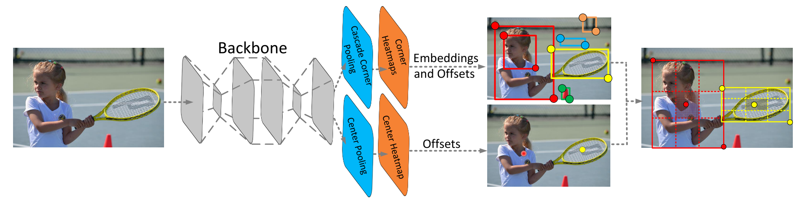
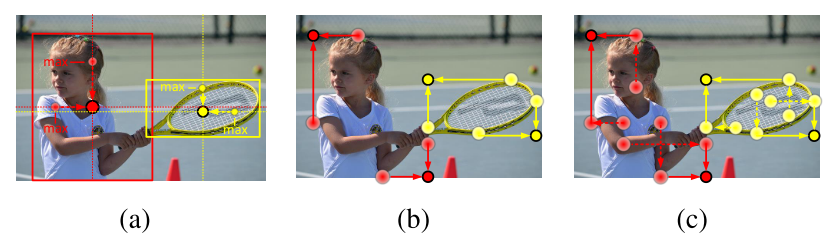
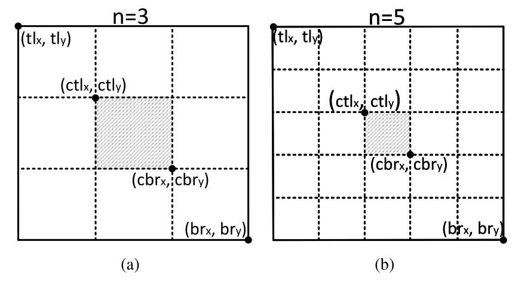
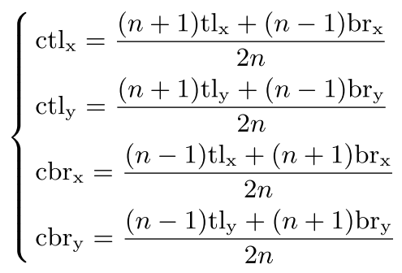
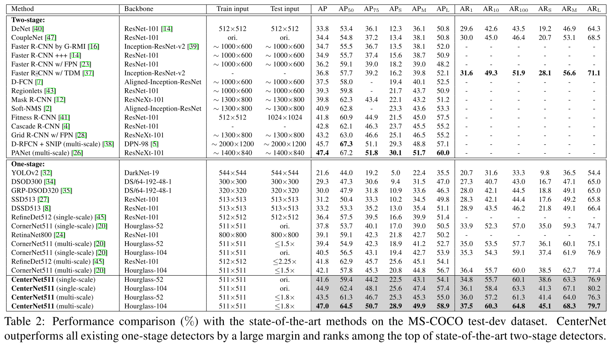
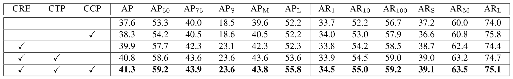
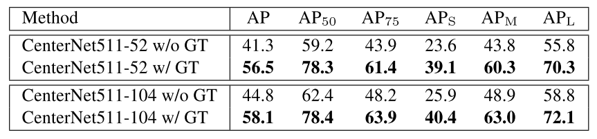

**2019/5/14**

# 《CenterNet: Keypoint Triplets for Object Detection》

來自中科院、牛津大學、華為諾亞實驗室的論文，藉由預測 corner point 及 center point 來 detect 物體，在 performance 上獲得不錯的成績。

### 簡介 Introduction

在此之前，已經有許多 work 利用 keypoint-based 來解 object detection task，例如 CornerNet 即是通過預測 bounding box 的左上角與右下角來做偵測。
本篇 CenterNet 基於 CornerNet 上再 propose 一個 center point 來有效降低錯誤框的比例，並且獲得了目前 one-stage detection 中最好的 AP。

### 方法 Method

上圖為本篇的主要架構，和 CornerNet 一樣藉由 two corners 來找出可能的框，再利用 center 來決定框的好壞，做出最後的 detection result。

#### Center Pooling

上圖中 (a) 即為 center pooling 的做法，主要流程是先在 feature map 中預測出 center point，再利用預測的 offset 投射回 image。
要判斷 feature map 中的某一點是否為 center point 時，作者認為只針對該點的 response 不夠 robust，因為像 human 的 pattern 主要在臉部，然而 human 的中心點通常不會在臉部，因此要融合更多的資訊。
做法是對於每個 pixel，找出它在垂直方向與水平方向的所有點中的最大 response 並加總，即為該 pixel 的 score，利用這樣的 pooling 會更能得出 robust 的中心點。

#### Cascade Corner Pooling
上一張圖片中的 (b) 是傳統的 corner pooling，對 top-left corner 而言，找出 pixel 右方及下方的最大值並加總即為分數。
然而，本篇認為這樣的方法只對邊界敏感，無法有效使用到物體中心的資訊。因此提出圖中 (c) 的 cascade corner pooling。
做法是找出兩個最大值後，再次往物體內側找最大值，新的兩最大值再加總以獲得最後得分。

#### Central Region Exploration

找出所有可能的 corner 後，計算任兩 corner 形成的 embedding vector 的距離，夠小的才會被當作可能包住同一個物體的框。
此時，對於每個框會有一個中心區域，在中心區域有包含住至少一個 center point ( 當然需要和 corner 相同類別 )的才會被留下，此時框的分數變成三個 keypoint 的分數平均；中心區域沒有包含 center point 的框就會被丟棄。

圖中 n 值在 box 面積大於 150 時會選擇 5 ，小於 150 則選擇 3，因為小物體的中心區域要大一點才不會太難框到中心點。

上圖為對於一個框的左上角及右下角，計算出中心區域的位置及大小，利用此方法會使得 box 面積越大，中心區域越小。

### 實驗 Experiments

上表為 MS-COCO dataset 的 performance 比較，可以看到 CenterNet 是 one-stage 中最高的方法。

上圖是 ablation study，CRE, CTP, CCP 分別代表 central region exploration, center pooling 及 cascade corner pooling。由 1, 3 row 可看出加上 center point 來確認框的好壞就有一定的成效。

上圖的 w/ GT 代表使用 ground truth 的 center point ( 應該是直接計算 ground truth box 的中心點 ) 來取代 predicted 的中心點，可以看到 center point 的預測還有一定的進步空間。
 
### 附錄 Appendix
Github: https://github.com/Duankaiwen/CenterNet  
arXiv: https://arxiv.org/abs/1904.08189  
