**2019/5/7**

# 《MetaAnchor: Learning to Detect Objects with Customized Anchors》

一篇 NIPS 2018 poster，提出一種新的 anchor box generation，能夠產生更多變的 anchor boxes。
作者群來自復旦大學及曠視科技，後者在 2018 COCO challenge 中拿到佳績。

### 簡介 Introduction

傳統的 anchor-based detection 是先將 anchor box 是先決定好 anchor 後，利用 network 生成出多個一定形狀、尺寸的 anchor boxes 作為 detection 的候選區。然而在設計 anchor 時需要非常小心，粗糙的 anchor 會導致 box 框不到欲檢測的物體；且不同的 dataset 有不同 distribution，anchor 的設計也得各自考慮。
本篇 paper 將 anchor function 改為由一個淺層 network 產生，不同的 anchor box 會產生不同的 anchor function，再利用 anchor function 來預測 object detection。利用本篇的方法，anchor 的選擇已經不再是固定的，而是能夠在 inferrence 的時候才由使用者去定義。

### 方法 Method
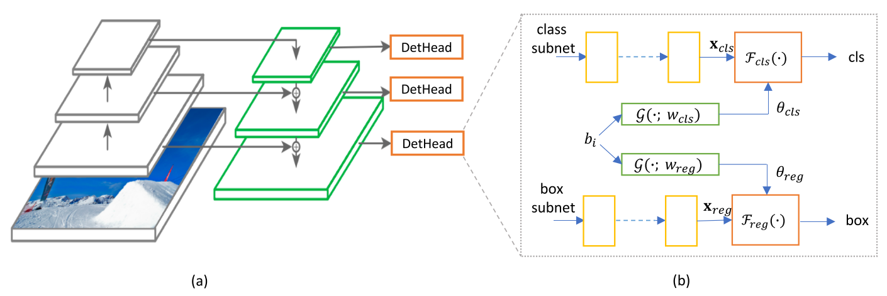

本篇是基於 RetinaNet 做 revise。前面的 backbone 沒有改變，後面每個 level 的 detection head 都加上一個 anchor function generator，該 generator 的公式為：  
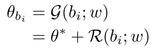  
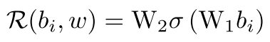

其中的 b_i 為 anchor box，omega 為 g 的參數，theta_bi 為 correspond to 當前 box 的 anchor function 的參數 (預測 theta 即為預測出 anchor function)。除了上面所提以外，作者也測試了當 anchor function 與 feature 有關時的表現，實驗結果在下一段，上式改為：  
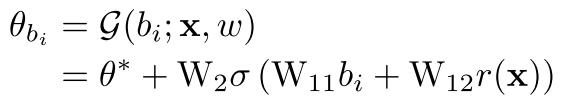

b_i 在 paper 中被設定為：  
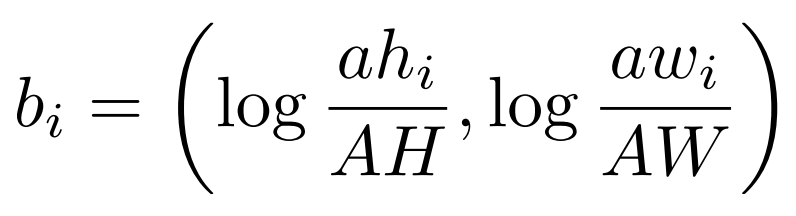

需注意到的是 AH、AW 為 standard anchor box 的尺寸，隨著 level 上升一層，AH、AW 應變為原本的兩倍，才符合原本設計的原意。

### 實驗 Experiments

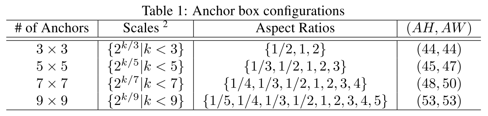
上圖為作者設計的 anchor box configuration，在 training 的時候，先選擇 5 x 5 的 configuration 得 25 個 anchor box (b_i)，對每個 b_i 進行 ±0.5 的 augment，將這些 augmentation 當作 training data。

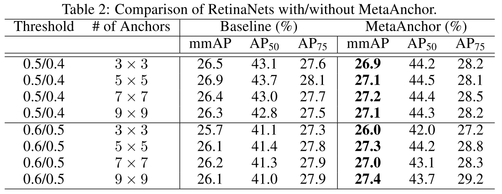  
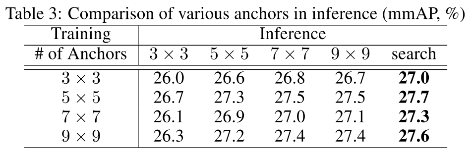  
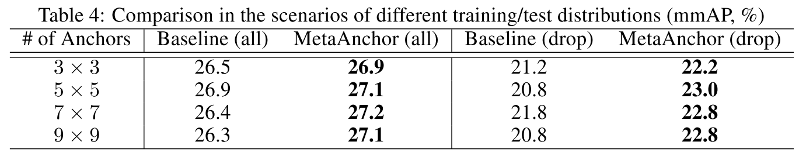  
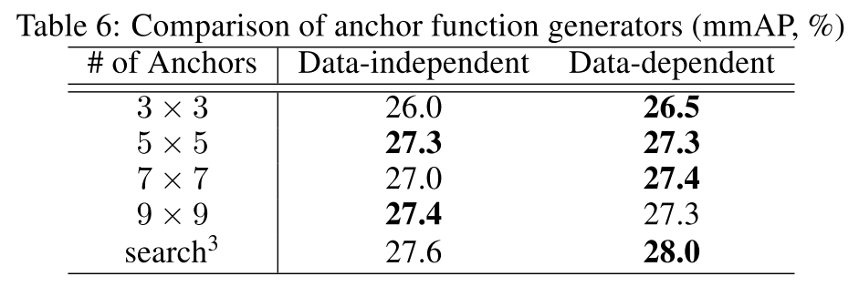  
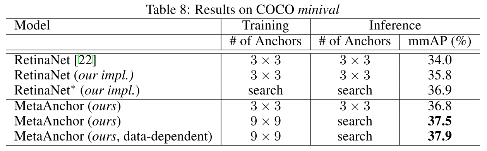  

圖中的 search 是一種 greedy 的做法，每次選取 b_i 後計算 prediction 並加到一部分 training set 的分數中，若能使分數提升，則加入此次 prediction ，否則不算入此次。

### 附錄 Appendix
Github: 
arXiv: https://arxiv.org/abs/1807.00980  
